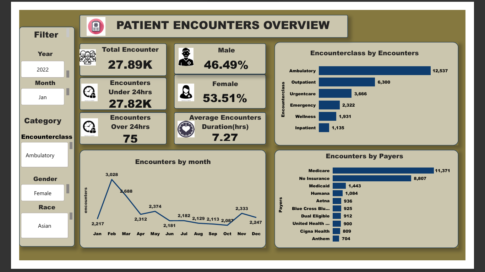
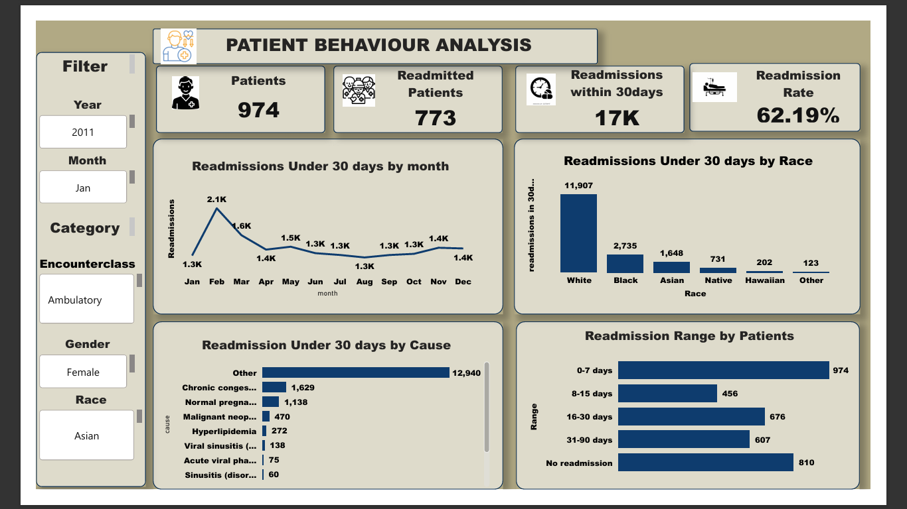

# Healthcare-readmission-analysis
Healthcare analytics project using SQL and Power BI to analyze patient encounters, healthcare utilization patterns, and 30-day return encounter behavior.


# # 🏥 Massachusetts Healthcare Encounters & Readmission Analysis

**Maven Data Challenge**  
End-to-end healthcare analytics project analyzing patient encounters and 30-day readmissions in Massachusetts (2011–2022).

---
## Data Source
This project uses a public dataset from Maven Analytics as part of a data analytics challenge.

[Data soure](https://www.mavenanalytics.io/challenges/maven-hospital-challenge)

[Live Dashboard link](https://drive.google.com/file/d/1g5bhZuPTeE-DM-8AuOHiTDGI3pso2Lll/view?usp=drive_link)


## 📌 Business Problem

Healthcare systems face increasing pressure from high 30-day readmission rates, which result in:

- Increased operational costs  
- Reduced hospital efficiency  
- Financial penalties under value-based care models  
- Gaps in post-discharge care coordination  

### 🎯 Objective

To analyze patient encounter data and identify patterns driving 30-day readmissions, enabling data-driven strategies to improve patient outcomes and reduce avoidable hospital returns.

---

## 🧰 Tech Stack

- **SQL (PostgreSQL)** — Data extraction, transformation, and feature engineering  
- **Power Query** — Data modeling and transformation  
- **Power BI** — Interactive dashboards and KPI visualization  
- **DAX** — Measures and calculated fields  

---

## 📊 Dataset Overview

The dataset spans **2011–2022** and includes:

- Patient demographics  
- Encounter records  
- Encounter classifications (ambulatory, inpatient, emergency, etc.)  
- Insurance/payer information  
- Medical conditions and diagnoses  
- Admission and discharge timestamps  

---

## 💻 SQL Data Processing (Key Logic)

The dataset was transformed using advanced SQL techniques including window functions, time calculations, and feature engineering.

[View Full SQL Code](SQL/encounters.sql)
### 1. Track previous encounter per patient (sequencing logic)
```sql
lag(stop) over (partition by patient order by start, stop) 
as previous_encounter
2. Calculate time between admissions (readmission window)
extract(epoch from (start - previous_encounter))/86400 
as since_last_admission
3. Core KPI: 30-day readmission definition
case 
    when previous_encounter is null then null
    when since_last_admission <= 30 then 'Yes'
    else 'No'
end as readmission_in_30days ```
----
```
---
2. Binary readmission flag (for Power BI measures)
 
  ``` sql
case
 when since_last_admission <= 30 then 1 
    else 0 
end as readmitted
```
---
3. Readmission time segmentation (clinical interpretation)
``` sql
case
    when since_last_admission <= 7 then '0-7 days'
    when since_last_admission <= 15 then '8-15 days'
    when since_last_admission <= 30 then '16-30 days'
    when since_last_admission <= 90 then '31-90 days'
    else 'No readmission'
end as readmission_range
``````
---
## 📊 Key Metrics

| Metric | Value |
|--------|------|
| Total Encounters | 27.89K |
| Total Patients | 974 |
| Readmitted Patients (30 days) | 773 |
| Readmission Rate | 62.19% |
| Dataset Period | 2011–2022 |

---

## 🔍 Key Insights

- Most encounters are concentrated in **ambulatory and outpatient care**, indicating low-acuity healthcare usage  
- **Medicare and uninsured patients** represent the highest utilization burden across the system  
- Readmissions are heavily concentrated within the **first 7 days post-discharge**, indicating early care and follow-up gaps  
- Chronic conditions such as congestive heart failure and malignancies are major drivers of repeat admissions  
- Female patients account for a slightly higher proportion of encounters and readmissions  

---

## 📈 Dashboards Overview

### Patient Encounters Overview
- Analyzes encounter volume, duration, payer distribution, and encounter types  
- Highlights outpatient-heavy utilization patterns  



---

### Readmission Analysis
- Tracks 30-day readmission trends  
- Breaks down readmission timing buckets (0–7, 8–15, 16–30, 31–90 days)  
- Identifies key clinical and demographic drivers  



---
## 📌 Recommendations

- Strengthen post-discharge follow-up within the first 7 days to reduce early readmissions  
- Implement chronic disease management programs for high-risk patients  
- Improve care coordination for Medicare and uninsured populations  
- Expand preventive and outpatient care pathways to reduce avoidable hospital visits  
- Develop predictive models to identify patients at high risk of 30-day readmission  

---

## 📊 Project Impact

This project demonstrates how healthcare data can be transformed into actionable insights that support:

- Reduction in preventable hospital readmissions  
- Improved patient care coordination and outcomes  
- Better allocation of healthcare resources  
- Data-driven decision-making in clinical operations  
- Strong foundation for predictive healthcare analytics  

---

## 🚀 Summary

This project showcases an end-to-end healthcare analytics workflow using SQL and Power BI, covering:

- Data extraction and transformation using SQL window functions  
- Readmission analysis using time-based patient tracking  
- KPI development for 30-day readmission monitoring  
- Interactive dashboards for healthcare decision-making  

It highlights the ability to translate raw healthcare data into meaningful business and clinical insights.

---

## 📚 Next Step: Python Learning Path

To further strengthen my analytics and data engineering skill set, the next focus areas include:

- Python for data analysis (Pandas, NumPy)  
- Data visualization (Matplotlib, Seaborn)  
- Predictive modeling (Scikit-learn)  
- Healthcare risk scoring models  
- API and data pipeline development  

This will enable a transition from descriptive analytics to **predictive healthcare analytics**.

---

## 🤝 Open to Opportunities

I am actively seeking opportunities in:

- Data Analyst roles (Entry-Level / Graduate / Junior)  
- Healthcare Analytics roles  
- Business Intelligence (BI) Analyst positions  
- Data Engineering Internships  
- Graduate Trainee Programs  

I am open to remote, hybrid, and on-site opportunities where I can contribute to data-driven decision-making and continue developing technical expertise.

---

## 📬 Contact

**Ike Ernest**  
Data Analyst | SQL | Power BI | Healthcare Analytics  

- GitHub: [github.com/ikeernest4700-lab]  
- LinkedIn: [https://www.linkedin.com/in/emeka-ike-108748198]  
- Email: [ikeernest4700@gmail.com]  

---

⭐ If you found this project useful, feel free to connect or reach out for collaboration opportunities.
